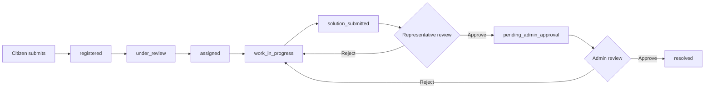

# TVK Namakkal West — Citizen Grievance Platform

Official web application for **தமிழக வெற்றிக் கழகம் (TVK) Namakkal West**. Citizens can register grievances, track resolution progress, and view public analytics. Representatives, field officers, and super admins manage the full complaint lifecycle through role-based dashboards.

**Languages:** Tamil (primary) + English  
**Stack:** Next.js 16 · React 19 · MongoDB · Cloudinary · Tailwind CSS 4

> **Note:** This project uses Next.js 16 with APIs that may differ from older Next.js versions. Read [AGENTS.md](AGENTS.md) and the [Next.js documentation](https://nextjs.org/docs) before extending the codebase. After `npm install`, local docs also live at `node_modules/next/dist/docs/index.md`.

---

## Table of Contents

1. [Features](#features)
2. [User Roles & Access](#user-roles--access)
3. [Complaint Workflow](#complaint-workflow)
4. [Folder Structure](#folder-structure)
5. [Prerequisites](#prerequisites)
6. [Installation & Setup](#installation--setup)
7. [Environment Variables](#environment-variables)
8. [Default Accounts (Development)](#default-accounts-development)
9. [Running the Application](#running-the-application)
10. [Pages & Routes](#pages--routes)
11. [API Reference](#api-reference)
12. [Database Collections](#database-collections)
13. [Voter Registry](#voter-registry)
14. [Media Uploads (Cloudinary)](#media-uploads-cloudinary)
15. [Security](#security)
16. [Scripts](#scripts)
17. [Deployment Notes](#deployment-notes)
18. [Troubleshooting](#troubleshooting)

---


## Features


| Area                      | Description                                                                       |
| ------------------------- | --------------------------------------------------------------------------------- |
| **Public home**           | TVK-branded landing page with grievance submission, events, and membership CTA    |
| **Voter verification**    | Validates citizen identity against the voter registry before complaint submission |
| **Complaint tracking**    | Public `/track` page — citizens look up status by tracking ID                     |
| **Analytics**             | Public dashboard with constituency-wise complaint statistics                      |
| **Representative portal** | Manage complaints, assign field officers, review submitted solutions              |
| **Field officer portal**  | View assigned tasks, capture before/after evidence, submit solutions              |
| **Admin portal**          | Super admin: representatives, voter registry, final approval queue, audit logs    |
| **Timeline**              | Every status change is recorded with timestamp, actor, and notes                  |
| **Whistle cursor**        | Branded custom cursor on key pages (disabled inside modals)                       |


---


## User Roles & Access


| Role               | Code             | Default landing          | Protected routes                         |
| ------------------ | ---------------- | ------------------------ | ---------------------------------------- |
| **Super Admin**    | `SUPER_ADMIN`    | `/analytics` or `/admin` | `/admin`, all `/api/admin/`*             |
| **Representative** | `REPRESENTATIVE` | `/analytics`             | `/complaints` (own constituency only)    |
| **Field Officer**  | `FIELD_OFFICER`  | `/my-tasks`              | `/my-tasks`, assigned complaints via API |


**Middleware** ([middleware.ts](middleware.ts)) enforces authentication via the `site_auth` cookie. Unauthenticated users are redirected to `/login?redirect=<path>`. Admin routes reject non–super-admin users with HTTP 403 or redirect to `/analytics`.

---


## Complaint Workflow




| Status                   | Tamil label                     | Who acts next  |
| ------------------------ | ------------------------------- | -------------- |
| `registered`             | பதிவு செய்யப்பட்டது             | Representative |
| `under_review`           | பிரதிநிதி ஆய்வில்               | Representative |
| `assigned`               | களப்பணியாளருக்கு ஒதுக்கப்பட்டது | Field officer  |
| `work_in_progress`       | களப்பணி நடைபெறுகிறது            | Field officer  |
| `solution_submitted`     | தீர்வு சமர்ப்பிக்கப்பட்டது      | Representative |
| `pending_admin_approval` | நிர்வாக ஒப்புதல் நிலுவையில்     | Super admin    |
| `resolved`               | தீர்க்கப்பட்டது                 | —              |


**PATCH actions** on `/api/complaints`: `assign`, `start_work`, `submit_solution`, `rep_approve`, `rep_reject`, `admin_approve`, `admin_reject`.

---


## Folder Structure

```
tvk-west/
├── app/                          # Next.js App Router
│   ├── page.tsx                  # Public home (grievance form, events, join CTA)
│   ├── home.css                  # Home page styles
│   ├── layout.tsx                # Root layout (Tamil metadata, fonts)
│   ├── globals.css
│   ├── login/page.tsx            # Staff login
│   ├── track/page.tsx            # Public complaint tracking
│   ├── analytics/                # Public analytics dashboard
│   │   ├── page.tsx
│   │   └── analytics.css
│   ├── complaints/page.tsx       # Representative complaint management
│   ├── my-tasks/page.tsx         # Field officer task dashboard
│   ├── admin/page.tsx            # Super admin dashboard
│   └── api/                      # Route handlers
│       ├── login/route.ts
│       ├── auth/me/route.ts
│       ├── complaints/route.ts
│       ├── track/route.ts
│       ├── voter/verify/route.ts
│       ├── representative/officers/route.ts
│       ├── public/
│       │   ├── analytics/route.ts
│       │   └── resolved/route.ts
│       └── admin/
│           ├── dashboard/route.ts
│           ├── representatives/route.ts
│           ├── voters/             # Registry CRUD, import, stats
│           └── demo/route.ts
├── components/
│   ├── WhistleCursor.tsx         # Custom TVK whistle cursor
│   ├── TvkAppFooter.tsx
│   └── admin/VoterRegistrySection.tsx
├── constants/
│   ├── roles.ts
│   ├── routes.ts
│   ├── statuses.ts
│   └── constituencies.ts
├── hooks/                        # Client data hooks (useAuth, useComplaints, …)
├── lib/                          # Server utilities
│   ├── mongodb.ts                # DB connection + lazy seed trigger
│   ├── dbSeed.ts                 # Indexes + default users + voter import
│   ├── session.ts                # Cookie signing / verification
│   ├── cloudinary.ts             # Media upload helpers
│   ├── voterLookup.ts            # Voter registry queries
│   ├── voterImport.ts            # Excel import logic
│   ├── Voter_List.xlsx           # Voter registry source (you must add this file locally)
│   ├── complaintStatus.ts
│   ├── security.ts               # Rate limits, sanitization, audit
│   └── brand.ts                  # Shared asset paths
├── services/                     # Business logic layer
├── types/                        # TypeScript interfaces
├── validators/                   # Request validation
├── utils/                        # Shared helpers (dates, maps)
├── public/                       # Static assets (images)
├── middleware.ts                 # Auth + role guards
├── next.config.ts
├── package.json
├── tsconfig.json
├── AGENTS.md                     # Agent / contributor rules
└── README.md
```

---


## Prerequisites


| Requirement         | Version / notes                                         |
| ------------------- | ------------------------------------------------------- |
| **Node.js**         | 20.x or later recommended                               |
| **npm**             | Comes with Node.js                                      |
| **MongoDB**         | Running locally on `mongodb://localhost:27017`          |
| **Cloudinary**      | Optional for dev; required for production media uploads |
| **Voter_List.xlsx** | Place at `lib/Voter_List.xlsx` for voter verification   |


---


## Installation & Setup

### 1. Clone and install dependencies

```bash
git clone https://github.com/Ramprasanth7119/tvk_namakkal_west.git
cd tvk_namakkal_west
npm install
```

Repository: [github.com/Ramprasanth7119/tvk_namakkal_west](https://github.com/Ramprasanth7119/tvk_namakkal_west)

### 2. Start MongoDB

Ensure MongoDB is running locally. The app connects to database `tvk-west` on the default port:

```
mongodb://localhost:27017/tvk-west
```

> Connection URI is currently defined in [lib/mongodb.ts](lib/mongodb.ts). Override via environment variable support can be added if needed for production.

### 3. Add voter registry (required for complaint submission)

Copy your voter Excel file to:

```
lib/Voter_List.xlsx
```

On first DB access, [lib/dbSeed.ts](lib/dbSeed.ts) automatically creates indexes, seeds default users (if empty), and imports voters from this file.

### 4. Configure environment variables

Create `.env.local` in the project root (see [Environment Variables](#environment-variables)).

### 5. Run the development server

```bash
npm run dev
```

Open [http://localhost:3000](http://localhost:3000).

---


## Environment Variables

Create `.env.local`:

```env
# Session signing (change in production!)
SESSION_SECRET=your-long-random-secret-key

MONGODB_URI=mongodb_url

# Legacy password-only login (username left blank)
SITE_PASSWORD=thalapathy

# Cloudinary — required for evidence / complaint media in production
CLOUDINARY_CLOUD_NAME=your_cloud_name
CLOUDINARY_API_KEY=your_api_key
CLOUDINARY_API_SECRET=your_api_secret

# Standard Node environment
NODE_ENV=development
```


| Variable         | Required         | Default               | Purpose                                          |
| ---------------- | ---------------- | --------------------- | ------------------------------------------------ |
| `SESSION_SECRET` | Production       | Built-in dev fallback | Signs `site_auth` session cookie                 |
| `SITE_PASSWORD`  | No               | `thalapathy`          | Password-only super admin login (empty username) |
| `CLOUDINARY_*`   | Production media | —                     | Upload complaint & field-officer evidence        |
| `NODE_ENV`       | No               | `development`         | Enables secure cookies in production             |


`.env*` files are gitignored — never commit secrets.

---


## Default Accounts (Development)

Seeded automatically when the `users` collection is empty:


| Username            | Password      | Role           | Constituency   |
| ------------------- | ------------- | -------------- | -------------- |
| `admin`             | `thalapathy`  | SUPER_ADMIN    | —              |
| `rep_komarapalayam` | `password123` | REPRESENTATIVE | குமாரபாளையம்   |
| `rep_namakkal`      | `password123` | REPRESENTATIVE | நாமக்கல்       |
| `rep_velur`         | `password123` | REPRESENTATIVE | பரமத்தி வேலூர் |


**Alternative login:** Leave username blank and enter `SITE_PASSWORD` (default `thalapathy`) to sign in as super admin.

Field officers are created by representatives (or super admin) from `/complaints` → **களப்பணி குழு** section.

---


## Running the Application


| Command         | Description                                             |
| --------------- | ------------------------------------------------------- |
| `npm run dev`   | Start dev server (Turbopack) at `http://localhost:3000` |
| `npm run build` | Production build                                        |
| `npm run start` | Run production server (after build)                     |
| `npm run lint`  | ESLint                                                  |


---


## Pages & Routes

### Public (no login)


| Path         | Description                                                                                |
| ------------ | ------------------------------------------------------------------------------------------ |
| `/`          | Home — submit grievance, view events, membership link to [tvk.family](https://tvk.family/) |
| `/track`     | Track complaint by tracking ID                                                             |
| `/analytics` | Public statistics dashboard                                                                |
| `/login`     | Staff authentication                                                                       |


### Authenticated


| Path          | Role                        | Description                                                  |
| ------------- | --------------------------- | ------------------------------------------------------------ |
| `/complaints` | Representative, Super Admin | Complaint inbox, assignment, FO management, rep review queue |
| `/my-tasks`   | Field Officer               | Assigned tasks, evidence capture, solution submission        |
| `/admin`      | Super Admin only            | Representatives, voter registry, final approval, dashboard   |


### Constituencies covered

- குமாரபாளையம் (Kumarapalayam)
- நாமக்கல் (Namakkal)
- பரமத்தி வேலூர் (Paramathi Velur)

---


## API Reference

### Public


| Method | Endpoint                 | Description                           |
| ------ | ------------------------ | ------------------------------------- |
| `POST` | `/api/voter/verify`      | Verify voter against registry         |
| `POST` | `/api/complaints`        | Submit new citizen complaint          |
| `GET`  | `/api/track?trackingId=` | Public tracking lookup                |
| `GET`  | `/api/public/analytics`  | Aggregated public stats               |
| `GET`  | `/api/public/resolved`   | Resolved complaints (public showcase) |
| `POST` | `/api/login`             | Authenticate staff                    |


### Authenticated


| Method           | Endpoint                       | Roles          | Description                                   |
| ---------------- | ------------------------------ | -------------- | --------------------------------------------- |
| `GET`            | `/api/auth/me`                 | All            | Current session user                          |
| `GET`            | `/api/complaints`              | Rep, FO        | List complaints (filtered by role)            |
| `PATCH`          | `/api/complaints`              | Rep, FO, Admin | Workflow actions (assign, submit, approve, …) |
| `GET/POST/PATCH` | `/api/representative/officers` | Rep, Admin     | Field officer CRUD                            |


### Admin only (`SUPER_ADMIN`)


| Method           | Endpoint                     | Description                           |
| ---------------- | ---------------------------- | ------------------------------------- |
| `GET`            | `/api/admin/dashboard`       | Admin dashboard data                  |
| `GET/POST/PATCH` | `/api/admin/representatives` | Manage representatives                |
| `GET/POST/…`     | `/api/admin/voters/`*        | Voter registry import, stats, history |


Rate limits apply per endpoint (e.g. voter verify: 10/hour/IP, login: 20/min/IP).

---


## Database Collections


| Collection          | Purpose                                          |
| ------------------- | ------------------------------------------------ |
| `users`             | Staff accounts (admin, reps, field officers)     |
| `citizenComplaints` | All grievances with timeline, media, assignments |
| `voterRegistry`     | Imported voter records                           |
| `importHistory`     | Voter Excel import audit trail                   |
| `auditLogs`         | Staff action audit trail                         |
| `security_logs`     | Login / security events (30-day TTL)             |
| `rate_limits`       | API rate limiting (TTL)                          |


Indexes are created automatically by [lib/dbSeed.ts](lib/dbSeed.ts) on first connection.

---


## Voter Registry

1. Prepare an Excel file matching the expected column layout (see [lib/voterColumnMap.ts](lib/voterColumnMap.ts)).
2. Save as `lib/Voter_List.xlsx`.
3. Restart the app or use **Admin → Voter Registry** to re-import.

The voter verify API (`POST /api/voter/verify`) matches voter ID, name similarity, and date of birth before allowing complaint submission on the home page.

---


## Media Uploads (Cloudinary)

When Cloudinary env vars are set:

- Citizen complaint photos/videos upload on submission.
- Field officers upload before/after images and videos with `submit_solution`.

If Cloudinary is **not** configured, complaint submission may still work for text-only flows; evidence uploads from field officers will fail until configured.

Upload folder prefix: `tvk-west/` (subfolders: `evidence/before`, `evidence/after`, `evidence/videos`).

---


## Security

- **Session cookie:** `site_auth` — HTTP-only, `SameSite=strict`, 7-day expiry
- **Password storage:** SHA-256 hashed ([lib/session.ts](lib/session.ts))
- **Middleware:** Protects `/complaints`, `/admin`, and authenticated API routes
- **Rate limiting:** MongoDB-backed per-IP limits on sensitive endpoints
- **Input sanitization:** Applied on login and complaint APIs
- **Audit logging:** Login and complaint status changes recorded

Change `SESSION_SECRET` and all default passwords before any production deployment.

---


## Scripts

```json
{
  "dev": "next dev",
  "build": "next build",
  "start": "next start",
  "lint": "eslint"
}
```

---


## Deployment Notes

1. Set all [environment variables](#environment-variables) on the host (Vercel, VPS, etc.).
2. Use a managed MongoDB instance and update [lib/mongodb.ts](lib/mongodb.ts) URI for production.
3. Configure Cloudinary for media-heavy workflows.
4. Place `Voter_List.xlsx` on the server — [next.config.ts](next.config.ts) includes it in the trace bundle for `/api/voter/verify`.
5. Run `npm run build && npm run start`.
6. Ensure HTTPS so secure cookies work (`NODE_ENV=production`).

Remote images from `www.tvknamakkaleast.com` are allowed in [next.config.ts](next.config.ts).

---


## Troubleshooting


| Issue                           | Likely cause                  | Fix                                              |
| ------------------------------- | ----------------------------- | ------------------------------------------------ |
| Voter verification fails        | Missing `lib/Voter_List.xlsx` | Add the Excel file and restart                   |
| "Unauthorized" on `/complaints` | No session cookie             | Log in at `/login`                               |
| Evidence upload fails           | Cloudinary not configured     | Set `CLOUDINARY_*` in `.env.local`               |
| MongoDB connection error        | MongoDB not running           | Start MongoDB on port 27017                      |
| Empty complaints for rep        | Wrong constituency on account | Check user record in `users` collection          |
| Whistle cursor stuck            | Modal open class              | Close modal; `modal-open` restores native cursor |


Database seeding logs appear in the terminal on first API/DB access. Seeding runs once per process lifecycle.

---

## License

Private project — TVK Namakkal West. All rights reserved.